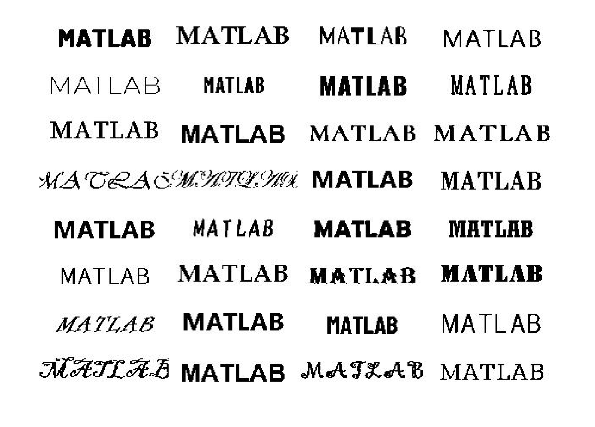

# 数字の画像を作って予測モデルを学習する話

[数独の楽しみが台無し！ブラウザで数独を解けるようにしてみた話](https://qiita.com/eigs/items/5058a5b70ffbac65a5b3) では割愛した数字の予測するモデル部分の解説です。

ポイントは

   -  学習用の画像は作ってしまう点 
   -  C コードに変換できるモデルにする点 

です。

数字を認識する方法は [OCR (Optical Character Recognition）](https://jp.mathworks.com/help/vision/optical-character-recognition-ocr.html)や [HOG 特徴量](https://jp.mathworks.com/help/vision/ug/digit-classification-using-hog-features.html)を使う例もありますし、ディープラーニングを使って手書き数字を認識する例はもはや見飽きていると思います。が、手軽なのでここでは見飽きた方法（CNN）を採用します。

# 学習に使用する画像の準備

今回の数独ソルバーで登場するのは主に活字の数字。当初は MNIST のデータを使って学習したんですが、フォントによっては認識精度がいまいち安定しませんでした。使用するフォントに関係なく（ついでに手書きも）認識されるようにしたい。

活字の画像はどこかに落ちていないかな～・・と少し探した後に「いや、MATLAB で作ればいいじゃないか」と行き着きました。

## フォント一覧

MATLAB で作るにしてもフォントはどうする？

とヘルプページを眺めていたところ見つかったのが、今回初めて使うことになった [`listfonts`](https://jp.mathworks.com/help/matlab/ref/listfonts.html) 関数。使用できるフォント一覧が取れます。

```matlab:Code
d = listfonts
```

```text:Output
d = 355x1 cell    
'Adobe Devanagari'     
'Agency FB'            
'Algerian'             
'Arial'                
'Arial Black'          
'Arial Narrow'         
'Arial Rounded MT Bold'
'AvantGarde'           
'Bahnschrift'          
'Barlow Condensed'     

```

じゃぁ、えいやと全フォントの数字を書き出せばいいや。実際に使用したコードは [generataDigitsImage2Train.m](https://github.com/minoue-xx/Sudoku-Solver-via-Wasm/blob/main/model/trainCNN/generataDigitsImage2Train.m) にありますがここで少し解説いたします。

ステップは

   1.  数字を [`text`](https://jp.mathworks.com/help/matlab/ref/text.html) でFigure 上に表示 
   1.  一時画像として保存 
   1.  画像サイズ等調整して再度保存 

です。画像サイズはここでは 56x56 とします。（特に強い根拠はないですが数独全体が大体 500 x 500 くらいの解像度で捉えられるなら、各数字はこれくらいで十分だろうということで。）

  
## 数字を [`text`](https://jp.mathworks.com/help/matlab/ref/text.html) でFigure 上に表示
### Figure 設定

まず Figure の大きさを固定します。

```matlab:Code
close all % 既存の Figure は削除（念のため）
h_fig = figure(1);
% h_fig.Visible = 'off'; % 非表示にしてもOK
h_fig.Units = 'pixels';
h_fig.Position = [100,100,150,150];
```

Figure のメニューボタンなどを除いた描画領域を 150x150 pixel に指定しています。

Figure の Position って結構奥深いんですよね・・こちらの投稿（[Positionよ，話せば分かる……！(分からない)](https://qiita.com/C2_now/items/3740a458ddf0a82dabfe) ）が大変わかりやすいのでぜひ。

### Axes 設定

そして Axes オブジェクト。 Figure の描画領域全体を使うよう Axes の大きさを設定します。表示範囲を 0 から 1 にし、座標軸も消す。

```matlab:Code
h_axes = gca;
h_axes.Units = 'normalized';
h_axes.Position = [0,0,1,1];
axis([0 1 0 1]);
axis off
```


こんな感じ。

### Position の注意点

実は Figure の大きさ設定でいきなりつまずいたんですが、、小さすぎると設定どおりに表示されないんです。例えば私の環境では

```matlab:Code(Display)
h_fig.Position = [100,100,100,100];
```

と指定しても表示される出てくる Figure の 'Position' は

```matlab:Code(Display)
>> h_fig.Positon
ans =
  100.0000  100.0000  118.6000  100.0000
```

と高さが違う。

なんやこれ！と憤っているとヘルプページの 'Position' の項目を確認するとしっかり書いてありました・・すいません。

”Windows オペレーティング システムでは、最小ウィンドウ幅と最大ウィンドウ サイズが適用されます。これらの範囲を超える Figure サイズを指定した場合、表示される Figure は指定されたサイズではなく、これらの範囲に従います。”（[引用元](https://jp.mathworks.com/help/matlab/ref/matlab.ui.figure-properties.html)）

  
### 数字を表示

真ん中に数字を描きます。ここでは数字の 1 を Times New Roman で描いてみます。

```matlab:Code
h_text = text(0.5,0.5,'3', ...
    HorizontalAlignment='center',...
    FontSize=50,...
    FontName='Times New Roman');
```

こんな感じ。FontSize はいくつか試していい感じに Axes 内に収まる大きさを決めました。そしてスクリーンの解像度で画像出力すると 150x150 の画像が出力されます。

```matlab:Code
print('-dpng','testimage.png','-r0');
```


サイズを変更するついでに今回の数独ソルバーでは入力される数字は、数字部分が 1 背景が 0 の 2 値画像なので、2値化＋反転させて再度保存します。

```matlab:Code
I = im2gray(imread('testimage.png'));
I = ~imbinarize(I,0.5);
I = imresize(I,[56,56]);

% save
filename = "3_Times New Roman.jpg";
imwrite(I,filename)
```

出来上がり。


あとはこれを、1\textasciitilde{}9 までそして、MATLAB で使えるフォントの数だけループで回せばOKです。3 の画像を一部表示するとこんな感じ。


### 余談

こんな形でいろんな MATLAB も楽しめます。



# モデルの学習

さて、データが用意できたので予測モデルを作りましょう。実際のコードは [trainCNNtoClassifyDigits.md](https://github.com/minoue-xx/Sudoku-Solver-via-Wasm/blob/main/model/trainCNN/trainCNNtoClassifyDigits.md)*（*数字認識する CNN の学習ステップ解説）を確認してもらうとして、あまり目新しいことはやっていないので、ポイントだけ。

## ネットワーク構造

ここでは、数字（0-9）を分類するようにネットワークを学習させますが、数独では 0を無視してもよいかも。ネットワークの構造はこのサンプル（[分類用のシンプルな深層学習ネットワークの作成](https://www.mathworks.com/help/deeplearning/ug/create-simple-deep-learning-network-for-classification.html)）を参考にします。サンプルでは手書き数字の 28x28 画像の分類でしたが、ここでは上で触れたとおり 56x56 の画像を使います。

注意：[`batchNormalizationLayer`](https://jp.mathworks.com/help/deeplearning/ref/nnet.cnn.layer.batchnormalizationlayer.html) は汎用（特定のライブラリに依存しない）C コード生成に対応していないため（R2021b現在）[`groupNormalizationLayer`](https://jp.mathworks.com/help/deeplearning/ref/nnet.cnn.layer.groupnormalizationlayer.html) に置き換えています。サポートされているレイヤーの一覧はこちら（最新版＝英語版を確認してください）：[C++ コード生成でサポートされているネットワークとレイヤー](https://www.mathworks.com/help/coder/ug/networks-and-layers-supported-for-c-code-generation.html)

何らかの正規化層があった方が学習が進みやすいです。[`batchNormalizationLayer`](https://jp.mathworks.com/help/deeplearning/ref/nnet.cnn.layer.batchnormalizationlayer.html) はミニバッチ全体で各入力チャネルを正規化しますが、[`groupNormalizationLayer`](https://jp.mathworks.com/help/deeplearning/ref/nnet.cnn.layer.groupnormalizationlayer.html) は各画像毎に各チャネルを正規化する違いがあります。こんな感じです。

```matlab:Code
inputSize = [56 56 1];
numClasses = 10;

layers = [
    imageInputLayer(inputSize)
    convolution2dLayer(6,16,'Padding','same')
    groupNormalizationLayer(16)
    reluLayer

    maxPooling2dLayer(2,'Stride',2)

    convolution2dLayer(3,8,'Padding','same')
    groupNormalizationLayer(8)
    reluLayer

    fullyConnectedLayer(numClasses)
    softmaxLayer
    classificationLayer];
```

## 画像のオーグメント

予測精度を安定させるために `imageDataAugmenter` を使って、画像のリサイズ・回転・移動などランダムな変更を加えた画像で学習させます。こんな感じ。

```matlab:Code
imageAugmenter = imageDataAugmenter( ...
    RandRotation=[-6,6], ...
    RandXTranslation=[-5 5], ...
    RandYTranslation=[-5 5], ...
    RandXScale=[1.0 1.2],...
    RandYScale=[1.0 1.2],...
    FillValue=0);

% 画像は digitsData フォルダ以下ある想定です。
imds = imageDatastore("digitsData",'IncludeSubfolders',true,'LabelSource','foldernames');
[imdsTrain,imdsValidate,imdsTest] = splitEachLabel(imds,0.8,0.1,0.1);
augimds = augmentedImageDatastore([56,56],imdsTrain,'DataAugmentation',imageAugmenter);
```

`imdsTrain` は学習用の画像へのデータストアですね。実際に学習に使われる画像を確認してみます。

同じ画像ファイルにたいして、毎回異なる変更を加えた画像が使われるので手軽に「学習データ増やした」のと似た効果が得られるわけです。

```matlab:Code
idx = randperm(length(augimds.Files),20);
for i = 1:numel(idx)
    subplot(4,5,i)
    img = readByIndex(augimds,idx(i));
    imshow(img.input{:})
end
```


## オプションを設定して学習！

```matlab:Code
options = trainingOptions('sgdm', ...
    'MaxEpochs',20, ...
    'ValidationFrequency',30, ...
    'Verbose',false, ...
    'ValidationData',imdsValidate,...
    'Plots','training-progress');
net = trainNetwork(augimds,layers,options);
```


## 精度の確認

テスト用に分けて置いた画像（`imdsTest`）で予測精度を確認します。

```matlab:Code
YPred = classify(net,imdsTest);
YTest = imdsTest.Labels;
accuracy = mean(YPred == YTest)
```

```text:Output
accuracy = 0.9400
```

```matlab:Code
figure
confusionchart(YTest,YPred)
```


かなり特徴のあるフォントも含まれる中なので、十分でしょう！あとは学習したネットワーク `net` を mat ファイルに保存して

```matlab:Code(Display)
% Copyright (c) 2021 Michio Inoue
function out = digitPredictFcn_CNN(XX) %#codegen

assert(isa(XX, 'double'));
assert(all( size(XX) == [56*56,1]));

persistent mynet;

if isempty(mynet)
    mynet = coder.loadDeepLearningNetwork('./trainCNN/digitPredictModel.mat');
end

XX = reshape(XX,[56,56]);
out = double(predict(mynet,XX));
```

こんな関数を作って C コードに変換する準備は完了です！

# まとめ

画像の作成からモデルの学習までをおさらいしました。

畳み込み層（[`convolution2dlayer`](https://jp.mathworks.com/help/deeplearning/ref/nnet.cnn.layer.convolution2dlayer.html)）が特定のライブラリに依存しない C コード生成に対応したのが R2021a。CNN をコード生成できると遊びの幅が広がるぞ！と大いに期待していたんですが、まさか [`batchNormalizationLayer`](https://jp.mathworks.com/help/deeplearning/ref/nnet.cnn.layer.batchnormalizationlayer.html) がネックになるとは想定外でした。畳み込み層が関わるいろんなサンプルで使われているので、すっと C コード生成まで持ってこれるよう今後の対応に期待大です。

他の部分は [数独の楽しみが台無し！ブラウザで数独を解けるようにしてみた話](https://qiita.com/eigs/items/5058a5b70ffbac65a5b3) を参照くださいませ。
