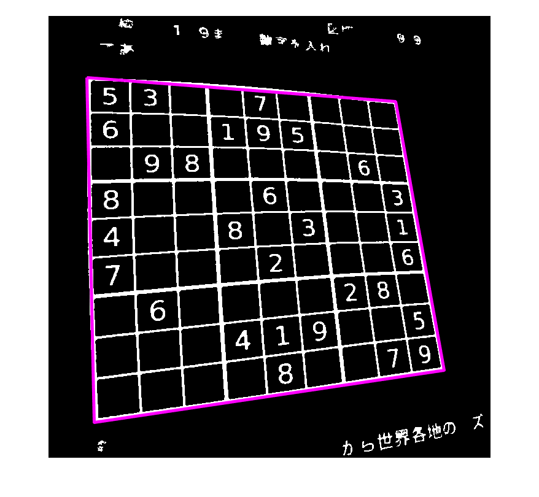

# ブラウザで数独を解けるようにしてみた話
  
# なにしたの？

GitHub Pages で動く数独ソルバーを作ってみました。

   -  [Sudoku Solver (PC で数独をカメラに映してライブで解くバージョン）](https://minoue-xx.github.io/Sudoku-Solver-via-Wasm/index.html) 
   -  [Sudoku Solver (画像を選択するバージョン、携帯はこちらがおススメ）](https://minoue-xx.github.io/Sudoku-Solver-via-Wasm/index_mobile.html) 

端末側ですべての処理は行われて撮った画像がどこかに送られることはないのでご安心ください（ソース：[GitHub: Sudoku Solver via Wasm](https://github.com/minoue-xx/Sudoku-Solver-via-Wasm)）


## この doc には何が書かれているのか

ここでは以下の ３ 点について簡単に紹介します。

   -  そもそもの動機 
   -  画像が処理される過程の解説 
   -  CNN での予測を安定化させるための工夫 

  
# なんでいまさらこんなことを・・

数独を解く例題はたくさんあるが、、何かソフトを立ち上げないと遊べないのはつまらない！ということで誰でも遊べるようにしたかっただけです。手軽に公開出来て・手軽にアクセスできるように GitHub Pages に上げました。

数独をプログラムで解かせる例は MATLAB だと

   -  [Solving Sudoku with MATLAB By Cleve Moler, MathWorks](https://jp.mathworks.com/company/newsletters/articles/solving-sudoku-with-matlab.html) 
   -  [整数計画法により数独パズルを解く: ソルバーベース](https://jp.mathworks.com/help/optim/ug/solve-sudoku-puzzles-via-integer-programming-solver-based.html) 

や、[File Exchange](https://jp.mathworks.com/matlabcentral/fileexchange?q=sudoku) で "Sudoku" で検索すると 63 件（2021/12/11 時点）もヒットします。中には画像から数独を認識させて解く例もあります。例えばこの 2 つ。前者はセミナーのつかみによく使ってました（笑）

   -  [Video Sudoku Solver by Teja Muppirala](https://jp.mathworks.com/matlabcentral/fileexchange/30088-video-sudoku-solver) 
   -  [Deep Sudoku Solver by Justin Pinkney](https://jp.mathworks.com/matlabcentral/fileexchange/68980-deep-sudoku-solver) 

後者はセマンティックセグメンテーションを使って Sudoku を画像から見つけて・・とかなり気合の入った力作です。2018 年に MATLAB Expo UK で ”Computer Vision and Image processing with MATLAB” として講演されました。英語ですが結構丁寧に解説されているので興味のある方は是非こちらチェックしてみてください。（[動画](https://jp.mathworks.com/videos/image-processing-and-computer-vision-with-matlab-1541003708736.html)、[ブログ](https://blogs.mathworks.com/deep-learning/2018/11/15/sudoku-solver-image-processing-and-deep-learning/)）

  
# 具体的にどうやったのか

手順は以下の通り

   1.  [Teja さんのコード](https://jp.mathworks.com/matlabcentral/fileexchange/30088-video-sudoku-solver)をベースに C コード生成できるように書き換え 
   1.  数字認識部分は CNN を使うように変更 
   1.  WebAssembly 化して JavaScript で呼び出し 

## ポイント１：できるだけ軽く・・

[Deep Sudoku Solver by Justin Pinkney](https://jp.mathworks.com/matlabcentral/fileexchange/68980-deep-sudoku-solver) のように CNN にいろいろお任せするのも 1 案ではありますが、今回はブラウザで動かすことを考えてできるだけ重い処理は避けたい。なので Deep Learning を使う部分は数字の認識だけにとどめて、更に軽いネットワークでも動くように、数値を取り出すところまでを画像処理で何とかすることにします。画像処理関係の関数は多くが C コード生成に対応しているので WebAssembly への変換も大丈夫です。数字認識（CNN での予測）も手軽に精度が安定するようにちょこっと工夫しました。

  
## ポイント２：WebAssembly 化

MATLAB Coder で C コード化して WebAssembly 化する部分は [GenerateJavaScriptUsingMATLABCoder, Geoff McVittie (2021)](https://jp.mathworks.com/matlabcentral/fileexchange/69973-generatejavascriptusingmatlabcoder) を使います。このツールは以前も Qiita で紹介しています。

   -  [MATLAB のニューラルネットをブラウザで動かす: MATLAB > C++ > WebAssembly の自動変換](https://qiita.com/eigs/items/48e782baf3ae617190cb) 
   -  [MATLAB -> C++ -> WebAssembly の自動変換を使った非線形最適化 on JavaScript](https://qiita.com/eigs/items/68cdcec7b8d56a5b440f) 

C コード生成に対応している処理であれば MATLAB の処理がそのまま Javascript に統合できるので便利。これは MathWorks 製品に含まれてはいませんが、社員が業務外で作って公開してくれたものです。最近のアップデートで MATLAB Coder アプリを使ってポチポチと変換できるようになったので手軽です。

実際に変換する際に wasm-ld: error: initial memory too small に遭遇しましたが、これは Emscripten からのメッセージで

`-s INITIAL_MEMORY=205914112`

というフラグを付けることで回避。背景は [@goccy](https://qiita.com/goccy) さんの「[1年間本番環境で WebAssembly ( by Emscripten )を使ってきた中で生じた問題とその解決策](https://qiita.com/goccy/items/1b2ff919b4b5e5a06110)」が参考になります。

  
## 主要な関数の説明

必要なソースコードは [GitHub: Sudoku Solver via Wasm](https://github.com/minoue-xx/Sudoku-Solver-via-Wasm) に置いてありますが、肝になる関数・スクリプトは以下の通りです。

   -  [solveSudokuImage_codegen.m](https://github.com/minoue-xx/Sudoku-Solver-via-Wasm/blob/main/model/solveSudokuImage_codegen.m)：今回コード生成するエントリー関数 
   -  [solveSudokuImage_codegen_script.m](https://github.com/minoue-xx/Sudoku-Solver-via-Wasm/blob/main/model/solveSudokuImage_codegen_script.m)：上の関数を WebAssembly 化するスクリプト 
   -  [testrun1_Image.m](https://github.com/minoue-xx/Sudoku-Solver-via-Wasm/blob/main/model/testrun1_Image.m)：静止画像に対しての処理を確認するスクリプト 
   -  [testrun2_Webcam.m](https://github.com/minoue-xx/Sudoku-Solver-via-Wasm/blob/main/model/testrun2_Webcam.m)：ウェブカメラ画像に対しての処理を確認するスクリプト 
   -  [digitPredictFcn_CNN.m](https://github.com/minoue-xx/Sudoku-Solver-via-Wasm/blob/main/model/digitPredictFcn_CNN.m)：CNN を使用した数字認識用関数 
   -  [trainCNNtoClassifyDigits.md](https://github.com/minoue-xx/Sudoku-Solver-via-Wasm/blob/main/model/trainCNN/trainCNNtoClassifyDigits.md)：数字認識する CNN の学習ステップ解説 
   -  [generataDigitsImage2Train.m](https://github.com/minoue-xx/Sudoku-Solver-via-Wasm/blob/main/model/trainCNN/generataDigitsImage2Train.m)：↑ の学習に使用する数字の画像作成スクリプト 

エントリー関数である [solveSudokuImage_codegen.m](https://github.com/minoue-xx/Sudoku-Solver-via-Wasm/blob/main/model/solveSudokuImage_codegen.m) は数独の画像（実装時は 750 x 750 で固定）を入力として受けて、解を上書きした画像を返します。JavaScript 側から受けるデータ形式に合わせて 1 次元のベクトルとして受ける点に注意です。

## 使用した Toolbox

   -  MATLAB R2021b 
   -  MATLAB Coder 
   -  Image Processing Toolbox 
   -  Deep Learning Toolbox 

# 画像処理ステップ

[Deep Sudoku Solver by Justin Pinkney](https://jp.mathworks.com/matlabcentral/fileexchange/68980-deep-sudoku-solver) のようにセマンティックセグメンテーションを使って数独を認識させるのも1案ではありますが、今回はブラウザで動かすことを考えてできるだけ重い処理は避けたい。Deep Learning を使う部分は数字の認識だけにとどめ、数値を取り出すところは数独を大きく撮るという撮影方法と＋画像処理で何とかすることにします。

ここでは入力画像がどのように処理されていくかの流れを紹介します。

## 入力画像の 2 値化 + ノイズ除去

まず携帯で撮影した画像を読み込んで 2 値化します。RGB イメージからバイナリ イメージを生成するには、まず [`rgb2gray`](https://jp.mathworks.com/help/matlab/ref/rgb2gray.html) でグレースケールに変換して [`imbinarize`](https://jp.mathworks.com/help/images/ref/imbinarize.html) で。`rgb2gray` も `imbinarize` も C コード生成対応関数ですね。

撮影状況も様々だろうと想定し、サンプルにある適応しきい値処理を使います。

```matlab:Code
addpath('../model')
Icam = imread('photoEx5.jpg');
figure
imshow(Icam)
```


```matlab:Code
Igray = rgb2gray(Icam);
Ibw = ~imbinarize(Igray,'adaptive', ...
    'ForegroundPolarity','dark', ...
    'Sensitivity',0.4); % codegen ok
tmp = Ibw; % 比較表示用
```

枠内に小さいゴミが見られるので画像全体の 0.01 % （サイズで 1%）より小さいものは [`bwareaopen`](https://jp.mathworks.com/help/images/ref/bwareaopen.html) を使って取り除きます。

```matlab:Code
thNoise = numel(Ibw)*0.0001; % 0.01%
Ibw = bwareaopen(Ibw,floor(thNoise)); % code gen ok
```

さらに今回はあまり気になりませんが、[`imclearborder`](https://jp.mathworks.com/help/images/ref/imclearborder.html) で外とつながっているピクセルを除去しておきます。しっかり画像に写っているものだけを気にします。画像を並べて比較するには [`montage`](https://jp.mathworks.com/help/images/ref/montage.html) ですね。

```matlab:Code
Ibw = imclearborder(Ibw); % code gen ok
figure
montage({tmp,Ibw},BackgroundColor='white',BorderSize=[10,10])
```


## 数独の認識

[`regionprops`](https://jp.mathworks.com/help/images/ref/regionprops.html) を使って一番大きな物体（ピクセルの集まり）を探します。数独の他に大きな物体が写り込んでいると上手くいかないので要注意。この辺は画像の撮り方で対処することにします。

```matlab:Code
R = regionprops(Ibw,'Area','BoundingBox','PixelList') % code gen ok
```

|フィールド|Area|BoundingBox|PixelList|
|:--:|:--:|:--:|:--:|
|1|44310|[62.5000,100.5000,58...|44310x2 double|
|2|53|[80.5000,692.5000,14...|53x2 double|
|3|51|[80.5000,701.5000,9,...|51x2 double|
|4|65|[84.5000,45.5000,22,...|65x2 double|
|5|255|[89.5000,117.5000,22...|255x2 double|
|6|324|[89.5000,170.5000,24...|324x2 double|
|7|382|[90.5000,284.5000,25...|382x2 double|
|8|311|[90.5000,344.5000,26...|311x2 double|
|9|235|[93.5000,406.5000,23...|235x2 double|
|10|180|[114.5000,4.5000,24,...|180x2 double|
|11|204|[116.5000,45.5000,23...|204x2 double|
|12|221|[156.5000,119.5000,2...|221x2 double|
|13|309|[157.5000,226.5000,2...|309x2 double|
|14|363|[166.5000,463.5000,2...|363x2 double|

結果は構造体ベクトルとして出てきますので、C コード生成対応している範囲で、一番 Area (面積) が大きい物体を探します。

```matlab:Code
areaMax = 0;
kmax = 0;
for ii=1:length(R)
    if areaMax < R(ii).Area
        areaMax = R(ii).Area;
        kmax = ii;
    end
end

% C コード生成しないならこんな書き方も。。
% [~,kmax] = max(vertcat(R.Area));
% tR = struct2table(R);
% [~,kmax] = max(tR.Area);
```

一番大きな物体の四隅のピクセル位置を探して、プロット。

```matlab:Code
tmpR = R(kmax);
tmp = tmpR.PixelList;
DIAG1 = sum(tmp,2);
DIAG2 = diff(tmp,[],2);

[~,dUL] = min(DIAG1);    [~,dDR] = max(DIAG1);
[~,dDL] = min(DIAG2);    [~,dUR] = max(DIAG2);

pts = tmpR.PixelList([dUL dDL dDR dUR dUL],:);

figure
imshow(Ibw)
hold on 
plot(pts(:,1),pts(:,2),'m','linewidth',3);
```



## 幾何学変換

大枠が捉えられたのでここから枠内の数字を抽出します。ただ、今回の画像は数独が斜めに写っていますので、まずは数独を正面に捉えた画像に幾何学的変換。[`fitgeotrans`](https://jp.mathworks.com/help/images/ref/fitgeotrans.html) を使います。その後は 9x9 の升に等分してその中身を数字のピクセルして取り出します。

```matlab:Code

fixedPoints = [1 1; 9 1; 9 9; 1 9]/10.*size(Ibw); % 変換後の数独の四隅の位置（正方形）
movingPoints = pts(1:4,:); % 変換前の数独の四隅

```

とその前に、数独がうまく捉えられていない場合は入力をそのまま返すようにエラー処理を入れておきます。数独として捉えただろう枠の面積が全体の 10 % に満たない場合はエラーとしておきます。もう少し大きく映してね。

```matlab:Code
boxarea = polyarea(movingPoints(:,1),movingPoints(:,2));

if boxarea/(1e6) < 0.1
    tmp = cat(3,Icam,zeros(N,N,1,'uint8'));
    tmp = permute(tmp,[3,2,1]);
    Imask = tmp(:);
    return
else
    transformationType = "projective";
    tform = fitgeotrans(movingPoints,fixedPoints, ...
        transformationType); % code gen ok % error occurs here for bad images
end
Ibw_warp = imwarp(Ibw,tform); % code gen ok
Icam_warp = imwarp(Icam,tform); % code gen ok

figure
montage({Ibw,Ibw_warp},BackgroundColor='white',BorderSize=[10,10])
```


## 再度大きい枠（数独）の探索＋中の数字を抽出

変換後の画像内の四隅のピクセル位置を同じ処理で見つけ、今度はその枠を 9x9 に等分します。


```matlab:Code
R = regionprops(Ibw_warp,'Area','BoundingBox','PixelList');

areaMax = 0;
kmax = 0;
for ii=1:length(R)
    if areaMax < R(ii).Area
        areaMax = R(ii).Area;
        kmax = ii;
    end
end

tmpR = R(kmax);
tmp = tmpR.PixelList;
DIAG1 = sum(tmp,2);
DIAG2 = diff(tmp,[],2);

[~,dUL] = min(DIAG1);    [~,dDR] = max(DIAG1);
[~,dDL] = min(DIAG2);    [~,dUR] = max(DIAG2);

pts = tmpR.PixelList([dUL dDL dDR dUR dUL],:);

figure
imshow(Ibw_warp)
hold on 
plot(pts(:,1),pts(:,2),'m','linewidth',3);

% 枠内の数字を取り出しますが、枠線が入ってしまうのでここも
% imclearborder で消しておきます。
data = cell(9,9);
xx = linspace(pts(1,1),pts(2,1),10); % 10 等分
yy = linspace(pts(2,2),pts(3,2),10); % 10 等分

% 枠内のピクセルを確保
for ii=1:9
    for jj=1:9
        tmp = imcrop(Ibw_warp,[xx(ii),yy(jj),...
            xx(ii+1)-xx(ii), yy(jj+1)-yy(jj)]); % code gen ok
        data{ii,jj} = imclearborder(tmp); % code gen ok
    end
end

% 9x9 の枠を表示
for ii=2:length(xx)-1
    plot([xx(ii),xx(ii)],[yy(1),yy(end)],'g');
end
for jj=2:length(yy)-1
    plot([xx(1),xx(end)],[yy(jj),yy(jj)],'g');
end
```


## 数字の認識前のエラー処理

さて、ここでようやく数字の認識を行いますが、ここでもちょっとしたエラー対策を行っておきます。数字が入っていないとすべて 0 の値が入っているはず・・なんですが、これまでのノイズ処理をすり抜けたピクセルがあるかもしれません。なので、枠内に入ったピクセルの中央値を計算しておき（`medianSize`) そのサイズの 10 % 以下の大きさのものは数字ではないとします。ノイズと判断しその枠内には数字はない、と判断することにします。 

```matlab:Code
% cellfun is not supported
sizes = zeros(81,1);
for ii=1:81
    sizes(ii) = sum(data{ii},'all');
end
% sizes = cellfun(@(x) sum(x,'all'),data(:));
medianSize = median(sizes(sizes>0));
```

ここは [`cellfun`](https://jp.mathworks.com/help/matlab/ref/cellfun.html) を使いたいところですが、C コード生成に対応していないので、地道に for ループで。。

## ようやく数字認識

`digits` に認識結果を保存しますが、「数字がない」は 0 を入れます。ここでは入力画像は 56x56 として学習した CNN を使います。予測する関数は以下の通り。

```matlab:Code
type digitPredictFcn_CNN.m
```

```text:Output
% Copyright (c) 2021 Michio Inoue
function out = digitPredictFcn_CNN(XX) %#codegen

assert(isa(XX, 'double'));
assert(all( size(XX) == [56*56,1]));

persistent mynet;

if isempty(mynet)
    mynet = coder.loadDeepLearningNetwork('./trainCNN/digitPredictModel.mat');
end

XX = reshape(XX,[56,56]);
out = double(predict(mynet,XX));
```

中身はこんな感じです。入力は 56x56 の画像でコード生成仕様になっています。


ここでコケると数独が解けません。なのでここでは認識精度が上がるよう以下の 2 点工夫しました。

   1.  数字の重心は画像の中心 
   1.  少し変換した複数の画像で予測し、最終結果は多数決で決定 

上で実施した幾何学変換もざっくりしたものなので、特に傾いた画像だと抽出した画像が中心からズレていることもあります。そして予測結果を観察していると、数字が中心からズレていると精度が悪い。

この辺は CNN を学習させるときに入力画像を中心からズラた画像を使うなど、学習データ側の工夫で処理してもよいですね（実際ある程度やっています）ただ、入力画像側でできることがあるならやっておいた方が安心。（参考：[深層学習ワークフローのための Image Processing Toolbox を使用したイメージ拡張](https://jp.mathworks.com/help/deeplearning/ug/image-augmentation-using-image-processing-toolbox.html)）

さらに１回の予測では不安なので、お手軽に検出を安定させるために入力画僧を回転・移動させたものに対しての予測結果の多数決を取るようにしています。回転・移動・拡大・縮小させた画像で学習させてはいるのですが、比較的単純なネットワークとしたからかこの辺は学習方法だけでは精度がいまいちでした。

```matlab:Code
digits = zeros(81,1);
for ii=1:81
    image = data{ii};

    if sum(image,'all') < medianSize/10
        digits(ii) = 0; % 数字無し
    else
        % 入力画像は 56x56 として学習した CNN を使います。
        image = imresize(image,[56,56]);

        % To increase robustness, 
        % 1. move the detected image to the center of the image.
        E = regionprops(image,'Centroid');
        Tx = 28-E(1).Centroid(1);
        Ty = 28-E(1).Centroid(2);
        image = imtranslate(image,[Tx Ty]);

        % 2. modify the image to create 5 versions and take the mode to
        % make the final decision.
        % Note that the expected input for the CNN is uint8. 
        % Since image is binary image, the image is multipled by 255.

        % prediction for the original image
        out = digitPredictFcn_CNN(double(image(:))*255);
        [~,cnnpred0] = max(out);

        % prediction for the image (x-translated)
        image1 = imtranslate(image,[5 0]);
        out = digitPredictFcn_CNN(double(image1(:))*255);
        [~,cnnpred1] = max(out);

        % prediction for the image (y-translated)
        image2 = imtranslate(image,[0 5]);
        out = digitPredictFcn_CNN(double(image2(:))*255);
        [~,cnnpred2] = max(out);

        % prediction for the image (rotated 1)
        image3 = imrotate(image,10,'crop');
        out = digitPredictFcn_CNN(double(image3(:))*255);
        [~,cnnpred3] = max(out);

        % prediction for the image (rotated 2)
        image4 = imrotate(image,-10,'crop');
        out = digitPredictFcn_CNN(double(image4(:))*255);
        [~,cnnpred4] = max(out);

        % Take mode to make the final decision.
        cnnpred = mode([cnnpred0,cnnpred1,cnnpred2,cnnpred3,cnnpred4]);
        digits(ii) = cnnpred-1;
    end
end

reshape(digits,[9,9])
```

```text:Output
ans = 9x9    
     5     6     0     8     4     7     0     0     0
     3     0     9     0     0     0     6     0     0
     0     0     8     0     0     0     0     0     0
     0     1     0     0     8     0     0     4     0
     7     9     0     6     0     2     0     1     8
     0     5     0     0     3     0     0     9     0
     0     0     0     0     0     0     2     0     0
     0     0     6     0     0     0     8     0     7
     0     0     0     3     1     6     0     5     9

```

入力した画像はこちら

```matlab:Code
figure
montage(data,ThumbnailSize=[40,40])
```


ちゃんと認識できていますね。

## ようやく数独を解ける・・

ここは目新しいことはないので飛ばしますが、関数 `Sudoku.m` は以下で紹介されているコードをほぼそのまま使っています。`cellfun` は使えないので for ループで置き換えています。

参考：[Solving Sudoku with MATLAB By Cleve Moler, MathWorks](https://jp.mathworks.com/company/newsletters/articles/solving-sudoku-with-matlab.html)

```matlab:Code
M = reshape(digits,[9,9])';
M_sol = Sudoku(M)
```

```text:Output
M_sol = 9x9    
     5     3     4     6     7     8     9     1     2
     6     7     2     1     9     5     3     4     8
     1     9     8     3     4     2     5     6     7
     8     5     9     7     6     1     4     2     3
     4     2     6     8     5     3     7     9     1
     7     1     3     9     2     4     8     5     6
     9     6     1     5     3     7     2     8     4
     2     8     7     4     1     9     6     3     5
     3     4     5     2     8     6     1     7     9

```

## ソリューションから画像を作成

まず、元々数字が入っていない位置にだけ答えの数字を表示した 2 値画像を作成します。

```matlab:Code
type solution2image_codegen
```

```text:Output
% Copyright (c) 2021 Michio Inoue
% A function generates an image with a solution overlayed to the original
% input image
function I = solution2image_codegen(M,Msol) %#codegen
% M: Sudoku puzzle (9x9)
% M_sol: Solution of the puzzle (9x9)
% I: Image of solution (digits are placed where the puzzle does not have
% digits)

% A image of each digits are pre-saved to mat file.
digits = coder.load('digitsSet.mat','digits');
I = true(180);

for k = 1:9
    for j = 1:9
        if ~M(k,j)
            if Msol(k,j) == 0
                tmp = digits.digits(:,:,10);
            else
                tmp = digits.digits(:,:,Msol(k,j));
            end
            I(20*(k-1)+1:20*k,20*(j-1)+1:20*j) = tmp;
        end
    end
end
```

こんな関数です。 画像ファイルの読み込みや Figure 系の処理での画像生成は C コードに変換できないので、`digitsSet.mat` に各数字（1-9）の画像を用意して読み込ませている点に注目。コード生成時にデータが読み込まれることになります。

```matlab:Code
I = solution2image_codegen(M,M_sol);
whos I
```

```text:Output
  Name        Size             Bytes  Class      Attributes

  I         180x180            32400  logical              
```

```matlab:Code
figure
imshow(I)
```


こんな感じ。そして画像にあった数独のサイズに [`imresize`](https://jp.mathworks.com/help/images/ref/imresize.html) で大きさを合わせて、、該当部分の色を変えるように処理します。

```matlab:Code
Iresize = imresize(~I,[pts(3,2)-pts(2,2),pts(2,1)-pts(1,1)]);

Imask = zeros(size(Icam_warp));
Imask(pts(2,2):pts(3,2)-1, pts(1,1):pts(2,1)-1,2) = Iresize;

tmp = Imask; % 比較表示用
Imask = Icam_warp .* uint8(~Imask);
figure
montage({tmp,Imask})
```


これで出来上がり！本当は幾何学変換後の画像ではなく元々の画像に答えを映したいところですが、幾何学変換の逆変換が C コード生成対象外なので手抜きしました。

# まとめ

ここまで紹介した一連の処理を WebAssembly 化して呼び出すことでブラウザで数独が解けるようになりました。数独の楽しみが台無しですが、是非遊んでみてください（笑）

UI に色気がない点は筆者の技術力不足ということで多めに見てください。もしこうしたらカッコイイよという提案ありましたらお待ちしています！
