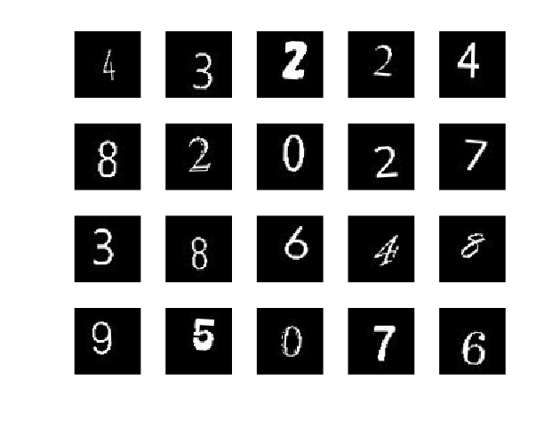

# Traing a simple CNN for digit classification
Copyright (c) 2021 Michio Inoue

Please run `generateDigitsImage2Train.m` to generate typed digit images to train the network. 

Note: If you want to include the hand-written images you can include the MNIST dataset.

```matlab:Code
% imageFileName = 'train-images.idx3-ubyte';
% labelFileName = 'train-labels.idx1-ubyte';
% addpath(fullfile(matlabroot,'examples','stats')); % add to the path
% [X,L] = processMNISTdata(imageFileName,labelFileName);
% rmpath(fullfile(matlabroot,'examples','stats')); % remove from the path
```

# Set the dataset

Create imageDatastore and split the dataset to train/validate/test the network.

```matlab:Code
imds = imageDatastore("digitsData",'IncludeSubfolders',true,'LabelSource','foldernames');
[imdsTrain,imdsValidate,imdsTest] = splitEachLabel(imds,0.8,0.1,0.1);
```

# Define the network

Here we train the network to classify the digits (0-9) but in this particular use case (Sudoku) we can ingore 0. The networks structure is follows the example: [Create Simple Deep Learning Network for Classification](https://www.mathworks.com/help/deeplearning/ug/create-simple-deep-learning-network-for-classification.html) for hand-written 28x28 images. Here the prepared images are of size 56x56.

Note: `batchNormalizationLayer` is not supported for generic C code generation (as of R2021b) so it's replaced by `groupNormalizationLayer`. For the list of supported layers, check this page: [Networks and Layers Supported for Code Generation](https://www.mathworks.com/help/coder/ug/networks-and-layers-supported-for-c-code-generation.html)

```matlab:Code
inputSize = [56 56 1];
numClasses = 10;

layers = [
    imageInputLayer(inputSize)
    convolution2dLayer(6,16,'Padding','same')
    groupNormalizationLayer(16)
    reluLayer

    maxPooling2dLayer(2,'Stride',2)

    convolution2dLayer(3,8,'Padding','same')
    groupNormalizationLayer(8)
    reluLayer

    fullyConnectedLayer(numClasses)
    softmaxLayer
    classificationLayer];
```

# Image Augmentation

In order to increase robustoness, we use `imageDataAugmenter` augment images with a random combination of resizing, rotation, and translation transformations..

```matlab:Code
imageAugmenter = imageDataAugmenter( ...
    'RandRotation',[-6,6], ...
    'RandXTranslation',[-5 5], ...
    'RandYTranslation',[-5 5], ...
    'RandXScale',[1.0 1.2],...
    'RandYScale',[1.0 1.2],...
    'FillValue',0);
augimds = augmentedImageDatastore([56,56],imdsTrain,'DataAugmentation',imageAugmenter);
```

Check the images

```matlab:Code
idx = randperm(length(augimds.Files),20);
for i = 1:numel(idx)
    subplot(4,5,i)
    img = readByIndex(augimds,idx(i));
    imshow(img.input{:})
end
```



# Set training options and train the network

```matlab:Code
options = trainingOptions('sgdm', ...
    'MaxEpochs',20, ...
    'ValidationFrequency',30, ...
    'Verbose',false, ...
    'ValidationData',imdsValidate,...
    'Plots','training-progress');
net = trainNetwork(augimds,layers,options);
```


# Check the performance

```matlab:Code
YPred = classify(net,imdsTest);
YTest = imdsTest.Labels;
accuracy = mean(YPred == YTest)
```

```text:Output
accuracy = 0.9629
```

```matlab:Code
figure
confusionchart(YTest,YPred)
```


Save the network,

```matlab:Code
save digitPredictModel.mat net
```
